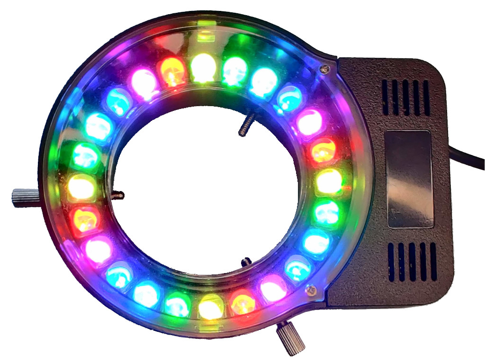
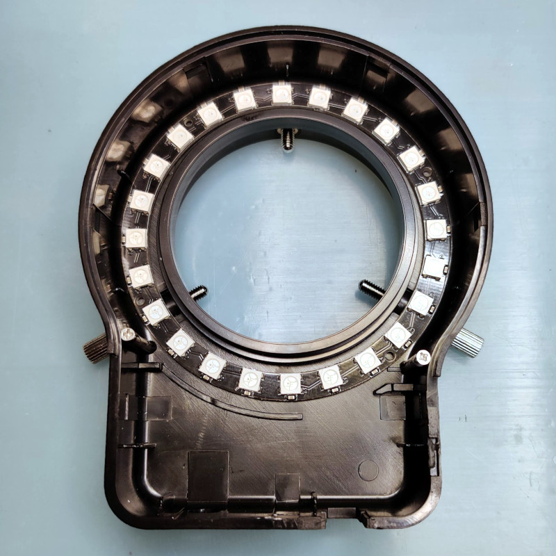
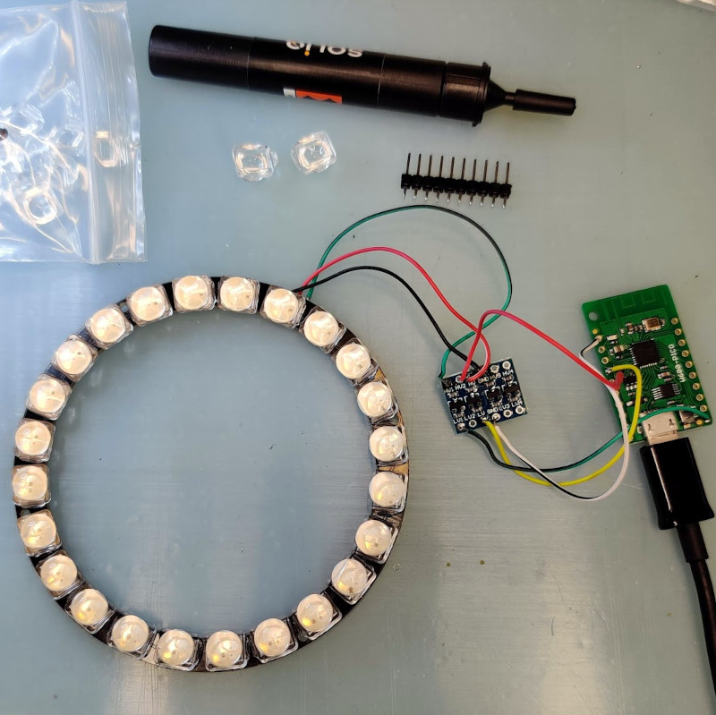
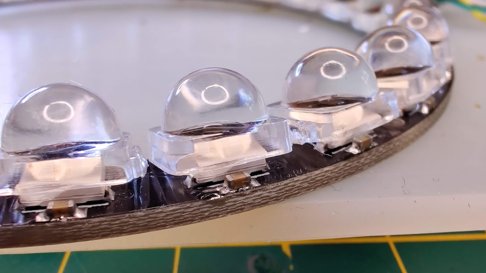
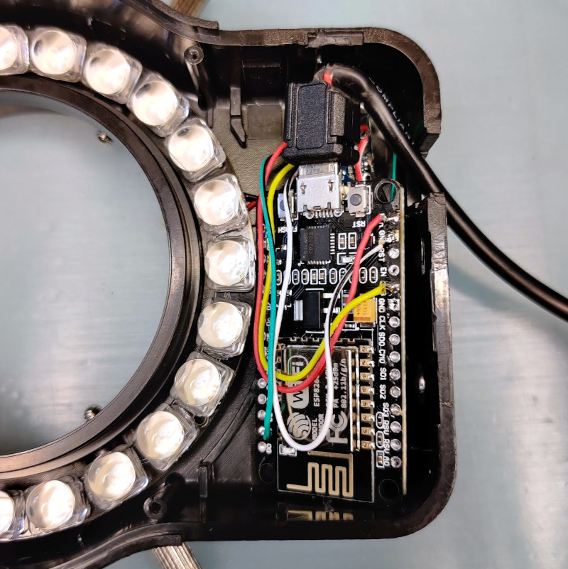

# RGB Illuminator Ring For Industry Microscope 



Demo: https://youtu.be/8CfzSZ4Gehk

## Inspiration

The idea came from a [tweet by @Siliconinsid](https://twitter.com/Siliconinsid/status/1367609351733719041) showing experimental sectorial Rheinberg illumination of a chip die with two different colors.


I'm using an industry / inspection microscope so I thought it could be interesting to modify an existing ring illuminator to integrate an RGB ring.

I immediately ordered the required components and 20 days later...

## BOM

* 12€ "Ring Illuminator Industry Microscope", e.g. [this one](https://www.aliexpress.com/item/32650371367.html) which is cheap as we'll keep only the enclosure
* 2.75€ "RGB led ring WS2812", e.g. [this one (24 LEDs model)](https://www.aliexpress.com/item/4000054747490.html)
* 2.10€ "30 degree lens for 5050 WS2812", e.g. [this one (30° 100pcs)](https://www.aliexpress.com/item/1005001860359687.html)
* 1.50€ "Level converter 3.3V 5V", e.g. [this one](https://www.aliexpress.com/item/32975077699.html)
* 3.20€ NodeMCU v2, e.g. [this one (v2)](https://www.aliexpress.com/item/32665100123.html)
  * Alternatively the WeMos D1 mini should do it as well and should fit more easily in the enclosure. See [more alternatives](https://frightanic.com/iot/comparison-of-esp8266-nodemcu-development-boards/).

Total with shipping: < 22€

When buying the ring enclosure and the RGB ring, make sure they fit. I've no idea if it'll be always the case or not...



We'll need also

* some wires
* a micro-USB cable (the USB cable of the ring only delivers power, it has no data wires)
* double-sided tape
* UV glue

## WS2812B

* [Datasheet](https://www.kitronik.co.uk/pdf/WS2812B-LED-datasheet.pdf)
* [Tutorial for MicroPython and ESP](https://randomnerdtutorials.com/micropython-ws2812b-addressable-rgb-leds-neopixel-esp32-esp8266/)

It uses a proprietary daisy-chain protocol.

## Wiring

No schematics but it's pretty easy.

| PC  | NodeMCU   | Level Shifter | RGB Ring |
|:---:|:---------:|:-------------:|:--------:|
| USB | Micro USB |               |          |
|     | GND       | GND           | GND      |
|     | 5V        | HV            | 5V       |
|     | 3V3       | LV            |          |
|     | D1=GPIO5  | LV1           |          |
|     |           | HV1           | DI       |

Outdated pic before I moved from W600 to NodeMCU:



Beware, when taping the ring in the enclosure, be sure to position it properly along horizontal/vertical.
Easiest is probably to start from a diagonal so you can define half and duplicate, e.g.:
`([verticale_color]*6+[horizontale_color]*6)*2`

## Lenses

To focus light towards the center of the ring, glue the 30° lenses slightly tilted with e.g. some UV glue.




## Misc

Consumption: 0.7A (3.3W) when all RGB are turned on and white.

One can add buttons or potentiometer to the design.
## NodeMCU v2

### Intro
ESP8266 with 4Mb of flash.

It barely fits in the enclosure:




Its IOs are driven at 3.3V. Firstly I thought the RGB ring would accept a data line driven at 3.3V. It kind of worked but with some weird artifacts. Adding a level shifter solved the issues.

* [Getting started with MicroPython on ESP8266](https://docs.micropython.org/en/latest/esp8266/tutorial/intro.html)
* [MicroPython Firmwares](https://micropython.org/download/esp8266/)
* [NeoPixel on MicroPython ESP8266](https://docs.micropython.org/en/latest/esp8266/tutorial/neopixel.html)

### Installing MicroPython
```bash
wget https://micropython.org/resources/firmware/esp8266-20210202-v1.14.bin
python3 -m pip install --user esptool
esptool.py --port /dev/ttyUSB0 erase_flash
esptool.py --port /dev/ttyUSB0 --baud 460800 write_flash --flash_size=detect 0 esp8266-20210202-v1.14.bin
```

### Usage
* `screen /dev/ttyUSB0 115200`
* REPL paste mode: `ctrl-e`; `ctrl-(shift-)v`; `ctrl-d`

Examples:
```python
import machine, neopixel, esp

RED = (255, 0, 0)
GREEN = (0, 255, 0)
BLUE = (0, 0, 255)
WHITE = (255, 255, 255)
BLACK = (0, 0, 0)

def esprgb(np, grb_list):
    esp.neopixel_write(np.pin, bytearray(i for grb in grb_list for i in grb), True)

# GPIO5 == D1 on NodeMCU
np = neopixel.NeoPixel(machine.Pin(5), 24)

# To address individual pixels
np[0] = BLUE
np[8] = RED
np[16] = GREEN
np.write()

# To inject directly a buffer:
esprgb(np, ([RED]*4+[BLACK]*2+[GREEN]*4+[BLACK]*2)*2)
time.sleep(1)
esprgb(np, ([GREEN]*4+[BLACK]*2+[RED]*4+[BLACK]*2)*2)
```

## File Transfer
Installation:
```
python3 -m pip install adafruit-ampy
```
Usage:
```
ampy --help
ampy -p /dev/ttyUSB0 -b 115200 ls
ampy -p /dev/ttyUSB0 -b 115200 get /boot.py > boot.py
ampy -p /dev/ttyUSB0 -b 115200 put main.py
```

## TODO test Wi-Fi

Example of web service for ESP8266 and RGB strip: https://github.com/petabite/uPixels based on https://github.com/petabite/uWeb

```
Wi-Fi initial config:
ESSID MicroPython-xxxxxx (end of MAC)
password: micropythoN
IP: 192.168.4.1
```

## WeMos W600-PICO

Initially I started this project with a WeMos W600-PICO as the board is smaller, but it has many limitations, therefore I moved to a NodeMCU.

Now outdated notes are available [here](w600/README.md), just in case.
